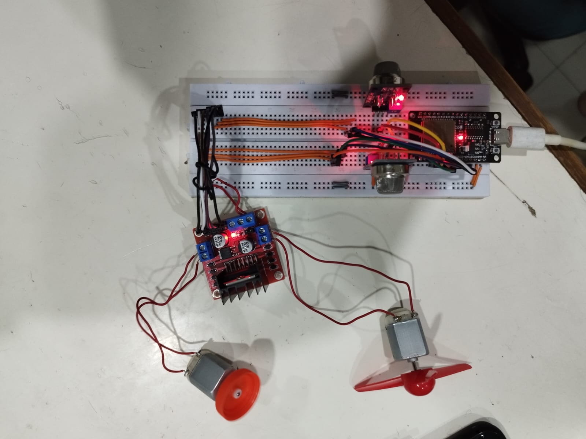
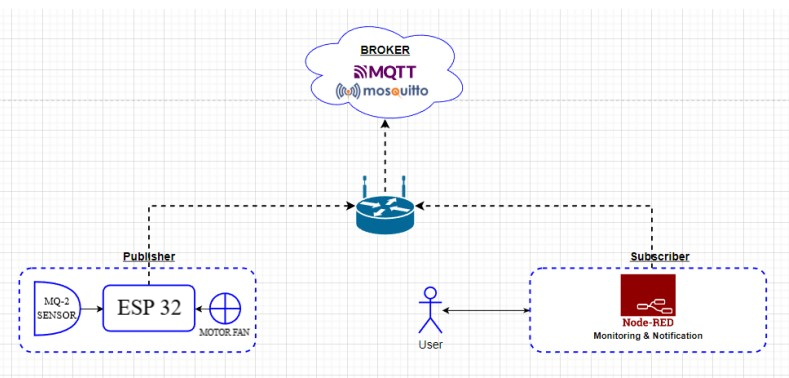
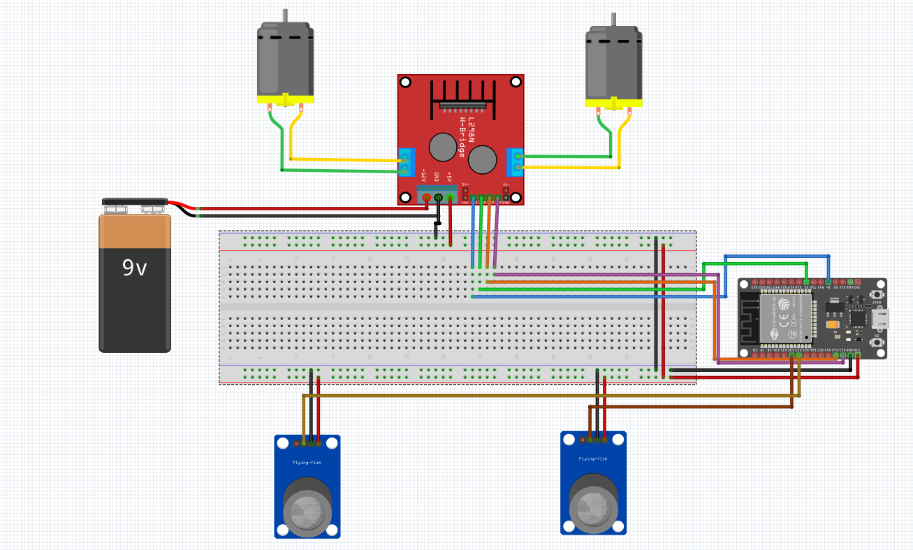

# Sistem Deteksi Dini dan Pencegahan Kebocoran Gas LPG Berbasis IoT

---

## Deskripsi Sistem
Proyek ini adalah sistem *Internet of Things* (IoT) komprehensif yang dirancang untuk mendeteksi dini kebocoran gas berbahaya (seperti LPG, Metana, Butana, Hidrogen, dan Asap) menggunakan sensor semikonduktor. 

Sistem ini tidak hanya berfungsi sebagai pendeteksi, melainkan juga memiliki mekanisme pencegahan (*mitigasi*) aktif. Saat konsentrasi gas melampaui ambang batas (*threshold*) yang ditentukan, sistem secara otomatis akan mengaktifkan motor DC berkecepatan tinggi yang mensimulasikan fungsi *exhaust fan* pada gudang penyimpanan gas LPG, guna menetralisir dan membuang gas keluar ruangan.

Pembangunan sistem ini dievaluasi melalui tiga iterasi teknologi komunikasi IoT:
1. **Protokol HTTP via Node-RED:** ESP32 bertindak sebagai *client* yang mengirim data via HTTP POST ke server Node-RED lokal di laptop.
2. **Protokol MQTT via 3rd Party Broker (Blynk):** ESP32 sebagai *Publisher* mengirim data ke server *Cloud Blynk* untuk dimonitor secara nirkabel lewat aplikasi seluler.
3. **Protokol MQTT via SBC Broker (Raspberry Pi):** Implementasi infrastruktur terdesentralisasi penuh, di mana *Raspberry Pi 3* berperan sebagai broker lokal (menggunakan **Mosquitto**). ESP32 menerbitkan data (*publish*) dan Node-RED (juga berjalan di Pi) berlangganan (*subscribe*) ke topik tersebut untuk divisualisasikan.

---

## Topologi Arsitektur (MQTT Broker Lokal)

  

Pada arsitektur *production* terdesentralisasi:
- **Sensor Node (Publisher):** Sensor ganda MQ-2 membaca konsentrasi gas dan mengubahnya menjadi sinyal digital melalui mikrokontroler ESP32.
- **Broker (Gateway):** Raspberry Pi 3 menjalankan layanan Mosquitto sebagai *Message Queuing Telemetry Transport* broker.
- **Dashboard (Subscriber):** Platform Node-RED berlangganan ke topik `sensor/mq2_1` dan `sensor/mq2_2`, menyajikan grafik *real-time* dan notifikasi bahaya.

---

## Spesifikasi Perangkat Keras

  

- **Mikrokontroler Utama:** ESP32
- **Komputasi Edge (Broker):** Raspberry Pi 3 Model B
- **Sensor:** 2x Sensor Gas MQ-2
- **Aktuator (Pencegahan):** 
  - 1x Driver Motor L298N (Mampu mengontrol arah dan kecepatan 2 motor DC secara simultan)
  - 2x Motor DC (Mensimulasikan kipas *Exhaust*)

## Dependensi Perangkat Lunak
Untuk kompilasi program pada ESP32, pastikan menginstal *library* berikut di Arduino IDE:
- `WiFi.h` (Koneksi Jaringan)
- `PubSubClient.h` (Komunikasi MQTT)
- `BlynkSimpleEsp32.h` (Komunikasi platform Blynk)
- `ArduinoJson.h` (Parsing data HTTP/JSON)

## Alur Kerja Sistem (Logika Kontrol Aktuator)
1. ESP32 secara konstan membaca nilai resistansi analog dari kedua sensor MQ-2.
2. Nilai diproses menggunakan ambang batas referensi (`threshold = 1300`).
3. Jika kondisi udara **Aman** (Nilai < 1300), maka kedua Kipas Exhaust (Motor DC) akan berputar pada kecepatan *idle/standby* (PWM: 100).
4. Jika kondisi udara **Bahaya** (Nilai > 1300), maka ESP32 akan langsung merespons dengan memutar Motor DC pada kecepatan maksimum (PWM: 200) untuk segera membuang gas.
5. Status *"AMAN"* atau *"BAHAYA"* bersama dengan nilai analog sensor diterbitkan (*publish*) ke sistem *dashboard* agar dapat dimonitor secara absolut oleh admin.

---

## Kontributor & Peran
**Ali Akbar Alhabsyi (ali1140)**
Repositori ini merepresentasikan dedikasi terhadap infrastruktur *Hardware* dan *Embedded System*. Dalam seluruh iterasi arsitektur jaringan di atas, tanggung jawab dan spesialisasi teknis saya berfokus pada:
- **Perancangan Topologi dan Rangkaian Elektrik (*Circuit Routing*)**
- **Penyolderan Komponen dan Perakitan Fisik (*Soldering & Hardware Assembly*)**
- **Pemrograman Logika Mikrokontroler (*ESP32 C++ Firmware*)**
- **Kalibrasi dan Akuisisi Data Sensor MQ-2**

---
*Dokumentasi ini disusun berdasarkan Laporan Desain dan Aplikasi Internet of Things (FTEIC-ITS).*
